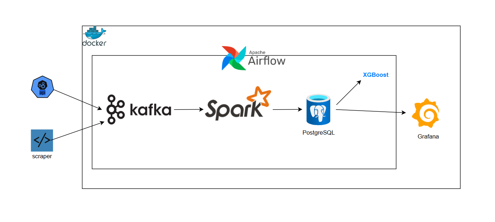

# Building a Daily News Analytics Pipeline with Airflow, Kafka, Spark, and Grafana
In this project, I built a batch data engineering pipeline to analyze daily news articles and uncover trending entities using Named Entity Recognition (NER). Each day, I use Airflow to orchestrate a workflow that pulls news data from the News API and stores it in Kafka. From there, a Spark batch job cleans the data and extracts entities like people, organizations, and locations, which are then saved in a Postgres database. Finally, Grafana visualizes trends over time. This project showcases how batch processing and modern data tools can be combined to deliver valuable insights from external data sources on a regular schedule.

## Read the Full Project Story
For a detailed walkthrough of this project, including architecture, tools, challenges, and learnings, check out my [Medium article here](https://medium.com/@houamrha/building-a-daily-news-analytics-pipeline-with-airflow-kafka-spark-and-grafana-333015e7ada9).

# Project Architecture

# .env example

AIRFLOW_UID=1000

API_KEY=fffffffffffffffffffffffffff

AIRFLOW_PROJ_DIR=.

_AIRFLOW_WWW_USER_USERNAME=airflow  
_AIRFLOW_WWW_USER_PASSWORD=airflow  
_PIP_ADDITIONAL_REQUIREMENTS=confluent-kafka

### For spark job
PG_URL=jdbc:postgresql://postgres:5432/news  
PG_USER=spark  
PG_PASSWORD=spark  
PG_TABLE=trending_entities  
PG_DATABASE=news

### Airflow database
POSTGRES_USER=airflow  
POSTGRES_PASSWORD=airflow  
POSTGRES_DB=airflow

### Grafana
ADMIN_USERNAME=admin  
ADMIN_FIRSTNAME=admin  
ADMIN_LASTNAME=admin  
ADMIN_EMAIL=admin@example.com  
ADMIN_PASSWORD=admin

# Useful Kafka commands

## Topic management

### List all topics
kafka-topics.sh --bootstrap-server $BROKER --list

### Create a new topic (1 partition, replication factor 1)
kafka-topics.sh --bootstrap-server $BROKER --create \
  --topic my-topic \
  --partitions 1 \
  --replication-factor 1

### Describe a topic
kafka-topics.sh --bootstrap-server $BROKER --describe --topic my-topic

### Delete a topic
kafka-topics.sh --bootstrap-server $BROKER --delete --topic my-topic

## Producing Messages

### Start a producer for a topic
kafka-console-producer.sh --bootstrap-server $BROKER --topic my-topic

### Send messages from a file
kafka-console-producer.sh --bootstrap-server $BROKER --topic my-topic < messages.txt

## Consuming Messages

### Consume messages from a topic (from beginning)
kafka-console-consumer.sh --bootstrap-server $BROKER --topic my-topic --from-beginning

### Consume with consumer group (commits offsets)
kafka-console-consumer.sh --bootstrap-server $BROKER \
  --topic my-topic \
  --group my-consumer-group \
  --from-beginning

### List all consumer groups
kafka-consumer-groups.sh --bootstrap-server $BROKER --list

### Describe a consumer group
kafka-consumer-groups.sh --bootstrap-server $BROKER \
  --describe --group my-consumer-group

### Delete a consumer group (if needed)
kafka-consumer-groups.sh --bootstrap-server $BROKER \
  --delete --group my-consumer-group

## Kafka Storage (KRaft only)

### Generate a new UUID for your cluster
kafka-storage.sh random-uuid

### Format storage directory (only run once per broker!)
kafka-storage.sh format \
  --cluster-id kraft-cluster-id \
  -c /path/to/server.properties

## Cleanup (for Dev/Local Use)

### Delete topic data manually (be careful!)
rm -rf /tmp/kafka-logs /tmp/kraft-combined-logs

### Reset offsets for a consumer group (dangerous)
kafka-consumer-groups --bootstrap-server $BROKER \
  --group my-consumer-group \
  --topic my-topic \
  --reset-offsets --to-earliest --execute

# Spark commands

## Check Spark version
spark-submit --version

## Run a PySpark script
spark-submit --packages org.apache.spark:spark-sql-kafka-0-10_2.12:3.5.1,org.apache.kafka:kafka-clients:3.5.1 /opt/spark-apps/kafka_consumer.py

# psql commands for postgres

\l => List all databases  
\c + dbname => Connect to a database  
\du => List all users/roles  
\dt => List tables in the current database  
\d + tablename => Describe table structure  
\q => Quit psql shell
