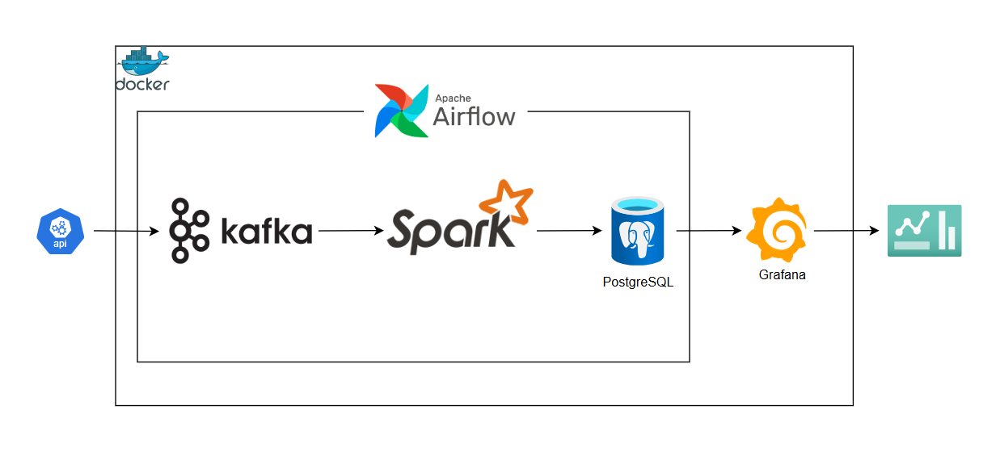

# Daily News Analytics Pipeline

<div align="center">


**An end-to-end batch data pipeline for analyzing news trends using Named Entity Recognition**

</div>

---

## 📖 Overview

This project implements a production-grade batch data engineering pipeline that analyzes daily news articles and tweets to identify trending entities (people, organizations, locations, events) using Named Entity Recognition (NER). The pipeline orchestrates data ingestion, processing, storage, and visualization using modern data engineering tools.

### What It Does

- **Ingests** news articles from News API and tweets from major news outlets
- **Processes** text data using Apache Spark with distributed NER extraction (spaCy)
- **Stores** structured entity data in PostgreSQL for analytics
- **Predicts** future trends using XGBoost time-series forecasting
- **Visualizes** trends and insights through Grafana dashboards
- **Orchestrates** the entire workflow with Apache Airflow on a daily schedule

---

## ✨ Features

### Data Engineering
- ✅ **Distributed Processing**: Apache Spark cluster for scalable NER extraction
- ✅ **Message Queue**: Kafka for decoupling data ingestion from processing
- ✅ **Incremental Processing**: Kafka offset tracking for resumable pipelines
- ✅ **Workflow Orchestration**: Airflow DAGs with retry logic and error handling
- ✅ **Data Quality**: Schema validation and null handling

### Machine Learning
- ✅ **Entity Extraction**: spaCy NER for identifying 8+ entity types
- ✅ **Trend Prediction**: XGBoost regression with lag features
- ✅ **Automated Training**: Daily model retraining with fresh data

### Infrastructure
- ✅ **Containerized**: Fully dockerized with Docker Compose
- ✅ **Scalable**: 1 master + 2 worker Spark cluster
- ✅ **Persistent Storage**: PostgreSQL with volume management
- ✅ **Monitoring UI**: Kafka UI, Spark UI, Airflow UI, Grafana

---

## 🏗️ Architecture



---

### Technology Stack

| Component | Technology | Purpose |
|-----------|-----------|---------|
| **Orchestration** | Apache Airflow 3.0.2 | Workflow scheduling and monitoring |
| **Message Queue** | Apache Kafka (KRaft) | Event streaming and buffering |
| **Processing** | Apache Spark 4.0.1 | Distributed data processing |
| **NER Engine** | spaCy (en_core_web_sm) | Named Entity Recognition |
| **Storage** | PostgreSQL 13 | Structured data warehouse |
| **ML Framework** | XGBoost | Time-series forecasting |
| **Visualization** | Grafana | Real-time dashboards |
| **Scraping** | Playwright | Twitter data collection |
| **Containerization** | Docker Compose | Service orchestration |

---

## 🚀 Quick Start

### Prerequisites

- Docker & Docker Compose
- 8GB+ RAM (for Spark cluster)
- 10GB+ disk space
- News API key ([get one free](https://newsapi.org/))
- Twitter account (for scraping authentication)

### Installation

**1. Clone the repository**
```bash
git clone https://github.com/HamzaOuamrhar/daily-news-batch-data-pipeline.git
cd daily-news-batch-data-pipeline
```

**2. Configure environment variables**
```bash
cp .env.example .env
```

Edit `.env` and set your credentials:
```env
# Core Configuration
AIRFLOW_UID=1000
GROUP_ID=1001
AIRFLOW_PROJ_DIR=.

# News API
API_KEY=your_newsapi_key_here

# Airflow Web UI
_AIRFLOW_WWW_USER_USERNAME=airflow
_AIRFLOW_WWW_USER_PASSWORD=airflow
_PIP_ADDITIONAL_REQUIREMENTS=confluent-kafka

# Spark Job Configuration
PG_URL=jdbc:postgresql://postgres:5432/news
PG_USER=spark
PG_PASSWORD=spark
PG_TABLE=trending_entities
PG_DATABASE=news

# Airflow Database
POSTGRES_USER=airflow
POSTGRES_PASSWORD=airflow
POSTGRES_DB=airflow
```

**3. Start all services**
```bash
make
```

This will start:
- PostgreSQL (port 5432)
- Kafka + Kafka UI (ports 9092, 8088)
- Spark Master + 2 Workers (ports 7077, 8081-8083)
- Airflow (API server, scheduler, dag processor) (port 8080)
- Grafana (port 3000)
- Twitter Scraper

**4. Access the services**

| Service | URL | Credentials |
|---------|-----|-------------|
| Airflow | http://localhost:8080 | airflow / airflow |
| Kafka UI | http://localhost:8088 | - |
| Spark Master | http://localhost:8081 | - |
| Grafana | http://localhost:3000 | admin / admin |

**7. Trigger the pipeline**

- Navigate to Airflow UI (http://localhost:8080)
- Enable the `fetch-and-produce-news` DAG
- Click "Trigger DAG" to run manually
- Monitor progress in the Graph or Grid view

---

## 📊 Pipeline Workflow

The Airflow DAG (`dags/news_stream.py`) orchestrates the following tasks:

```
┌────────────────┐
│  fetch_news    │  ──▶ Fetch news from News API
└───────┬────────┘
        │
┌───────▼────────┐
│  backup_news   │  ──▶ Archive news to backup file
└───────┬────────┘
        │
┌───────▼────────┐
│  scrap_tweets  │  ──▶ Scrape tweets from news outlets
└───────┬────────┘
        │
┌───────▼────────┐
│  merge_tweets  │  ──▶ Consolidate scraped tweets
└───────┬────────┘
        │
┌───────▼────────────────┐
│ produce_news_to_kafka  │  ──▶ Send news to Kafka topic
└───────┬────────────────┘
        │
┌───────▼──────────────────┐
│ produce_tweets_to_kafka  │  ──▶ Send tweets to Kafka topic
└───────┬──────────────────┘
        │
┌───────▼──────────────────┐
│ spark_kafka_to_postgres  │  ──▶ Process with Spark NER
└───────┬──────────────────┘
        │
┌───────▼────────┐
│ create_dataset │  ──▶ Prepare training data
└───────┬────────┘
        │
┌───────▼────────┐
│  train_model   │  ──▶ Train XGBoost predictor
└────────────────┘
```

### Task Details

1. **fetch_news**: Retrieves top US headlines from News API
2. **backup_news**: Appends daily news to historical backup file
3. **scrap_tweets**: Uses Playwright to scrape tweets from configured sources
4. **merge_tweets**: Combines individual scraped files into single dataset
5. **produce_news_to_kafka**: Publishes news articles to `news-topic`
6. **produce_tweets_to_kafka**: Publishes tweets to `tweets-topic`
7. **spark_kafka_to_postgres**: 
   - Reads messages from both Kafka topics
   - Extracts entities using spaCy NER
   - Writes to `trending_entities` table
   - Updates Kafka offsets for incremental processing
8. **create_dataset**: Generates time-series features for ML training
9. **train_model**: Trains XGBoost model to predict next-day entity mentions

---

## 🔧 Configuration

### Entity Types

The pipeline extracts these entity types:
- **PERSON**: People, including fictional
- **ORG**: Companies, agencies, institutions
- **GPE**: Countries, cities, states
- **LOC**: Non-GPE locations, mountain ranges, bodies of water
- **EVENT**: Named hurricanes, battles, wars, sports events
- **PRODUCT**: Objects, vehicles, foods
- **WORK_OF_ART**: Titles of books, songs, etc.
- **FAC**: Buildings, airports, highways, bridges

Filter in `spark/kafka_batch_to_postgres.py`:
```python
query = r"""
    SELECT DISTINCT entity_text FROM trending_entities 
    WHERE entity_type IN ('EVENT', 'FAC', 'GPE', 'LOC', 'ORG', 'PERSON', 'PRODUCT', 'WORK_OF_ART')
"""
```

---

## 📁 Project Structure

```
daily-news-batch-data-pipeline/
├── dags/
│   └── news_stream.py              # Main Airflow DAG
├── plugins/
│   └── train_model.py              # XGBoost training script
├── scraper/
│   ├── Dockerfile                  # Scraper container config
│   ├── requirements.txt            # Python dependencies
│   ├── run_scraper.py             # CLI wrapper for scraping
│   ├── data-sources.txt           # Twitter accounts to scrape
│   └── app/
│       ├── scraper.py             # Core scraping logic
│       ├── save_twitter_cookies.py # Authentication helper
├── spark/
│   └── kafka_batch_to_postgres.py # Spark NER processing job
├── logs/                          # Airflow logs (gitignored)
├── docker-compose.yaml            # Service orchestration
├── init-user-db.sh               # PostgreSQL initialization
├── Makefile                      # Convenience commands
├── .env                          # Environment variables (gitignored)
├── README.md                     # This file
└── IMPROVEMENTS.md               # Future enhancement roadmap
```

---

## 🛠️ Development

### Makefile Commands

```bash
# Start all services
make

# Restart and rebuild
make re

# Stop all services
make down

# Clean all containers and images
make clean

# Nuclear clean (includes volumes)
make super_clean

# Access container shells
make airflow    # Airflow API server
make kafka      # Kafka broker
make spark      # Spark master
make psql       # PostgreSQL
make s          # Scraper

# Rebuild specific service
make build

# Scraper controls
make su         # Start scraper only
make sd         # Stop scraper only
```

### Manual Spark Job Execution

```bash
# Enter Spark master container
make spark

# Run the processing job manually
spark-submit \
  --packages org.postgresql:postgresql:42.7.3,org.apache.spark:spark-sql-kafka-0-10_2.12:3.5.1,org.apache.kafka:kafka-clients:3.5.1 \
  /opt/spark-apps/kafka_batch_to_postgres.py
```

### Kafka Topic Management

```bash
# Enter Kafka container
make kafka

# Set environment variable
export BROKER=localhost:9092

# List topics
kafka-topics.sh --bootstrap-server $BROKER --list

# Describe topic
kafka-topics.sh --bootstrap-server $BROKER --describe --topic news-topic

# Consume messages
kafka-console-consumer.sh --bootstrap-server $BROKER --topic news-topic --from-beginning

# Reset consumer group offsets
kafka-consumer-groups.sh --bootstrap-server $BROKER \
  --group my-group \
  --topic news-topic \
  --reset-offsets --to-earliest --execute
```

### PostgreSQL Operations

```bash
# Enter PostgreSQL container
make psql

# Connect to news database
psql -U spark -d news

# Useful commands
\l                              # List databases
\c news                         # Connect to database
\dt                            # List tables
\d trending_entities           # Describe table
SELECT COUNT(*) FROM trending_entities;  # Count entities
\q                             # Quit
```

---

## 📈 Data Schema

### trending_entities

| Column | Type | Description |
|--------|------|-------------|
| id | SERIAL PRIMARY KEY | Unique identifier |
| entity_text | VARCHAR(255) | Extracted entity name |
| entity_type | VARCHAR(50) | Entity category (PERSON, ORG, etc.) |
| published_date | DATE | Article/tweet publication date |

### dates

| Column | Type | Description |
|--------|------|-------------|
| the_date | DATE PRIMARY KEY | Unique date entries |

### trends

| Column | Type | Description |
|--------|------|-------------|
| id | SERIAL PRIMARY KEY | Unique identifier |
| group_id | VARCHAR(255) | Entity name |
| date | DATE | Prediction date |
| predicted_count | INTEGER | Predicted mention count |

---

## 🐛 Troubleshooting

### Airflow DAG Not Appearing

```bash
# Check DAG file for syntax errors
docker exec -it api-server airflow dags list

# View DAG parsing errors
docker exec -it api-server airflow dags list-import-errors
```

### Spark Job Failing

```bash
# Check Spark logs
docker logs spark-master
docker logs spark-worker

# Verify Kafka connectivity
docker exec -it spark-master nc -zv kafka 9092

# Test PostgreSQL connection
docker exec -it spark-master psql -h postgres -U spark -d news
```

### Twitter Scraper Issues

```bash
# Re-authenticate
make s
cd app
python3 save_twitter_cookies.py

# Check cookies file exists
ls -la twitter_cookies.json

# View scraper logs
docker logs scraper
```

### Out of Memory

If Spark workers run out of memory:

1. Reduce worker memory in `docker-compose.yaml`:
```yaml
SPARK_WORKER_MEMORY=512M  # Reduce from 1G
```

2. Or increase Docker memory allocation (Docker Desktop settings)

### Kafka Offset Issues

```bash
# Reset offsets if processing stuck
docker exec -it kafka kafka-consumer-groups.sh \
  --bootstrap-server localhost:9092 \
  --group spark-kafka-consumer \
  --reset-offsets --to-earliest --execute \
  --topic news-topic
```

---

## 📊 Monitoring & Observability

### Metrics to Track

- **Pipeline Success Rate**: Percentage of successful DAG runs
- **Entity Extraction Count**: Total entities extracted per day
- **Processing Latency**: Time from ingestion to storage
- **Kafka Lag**: Message backlog in topics
- **Spark Job Duration**: Time for NER processing

### Grafana Dashboard Setup

1. Access Grafana at http://localhost:3000
2. Add PostgreSQL data source:
   - Host: `postgres:5432`
   - Database: `news`
   - User: `spark`
   - Password: `spark`
3. Create visualizations:
   - **Time series**: Entity mentions over time
   - **Bar chart**: Top trending entities
   - **Table**: Recent predictions
   - **Stat panel**: Total entities count

### Sample Query for Grafana

```sql
-- Top 10 trending entities this week
SELECT 
    entity_text,
    COUNT(*) as mention_count
FROM trending_entities
WHERE published_date >= CURRENT_DATE - INTERVAL '7 days'
GROUP BY entity_text
ORDER BY mention_count DESC
LIMIT 10;
```

---

## 🧪 Testing (Future Enhancement)

- Unit tests for data transformations
- Integration tests for pipeline flow
- Data quality validation tests
- CI/CD with GitHub Actions

---

## 🔐 Security Considerations

⚠️ **Important**: This is a development project. For production:

1. **Secrets Management**: Use Vault or AWS Secrets Manager instead of `.env`
2. **Network Security**: Implement network policies and firewalls
3. **Authentication**: Enable RBAC in Airflow, SASL in Kafka
4. **Encryption**: Use SSL/TLS for all connections
5. **Access Control**: Restrict PostgreSQL and service access
6. **Cookie Security**: Encrypt Twitter cookies at rest

---

## 🚀 Performance Optimization

### Current Bottlenecks
- Single Kafka broker (no replication)
- LocalExecutor in Airflow (single machine)
- Fixed Spark cluster size
- No caching layer

### Optimization Strategies
1. **Kafka**: Add replication factor 3, increase partitions
2. **Spark**: Enable dynamic allocation, tune memory settings
3. **PostgreSQL**: Add indexes on `entity_text`, `published_date`, `entity_type`
4. **Caching**: Add Redis for frequently accessed data
5. **Batch Size**: Tune Spark batch processing window

---

## 📞 Contact

**Hamza Ouamrhar**
- GitHub: [@HamzaOuamrhar](https://github.com/HamzaOuamrhar)
- Medium: [@houamrha](https://medium.com/@houamrha)
- LinkedIn: [Connect with me](https://www.linkedin.com/in/hamza-ouamrhar/)

---

<div align="center">

**⭐ Star this repo if you find it helpful!**

Built with ❤️ by Hamza Ouamrhar

</div>
